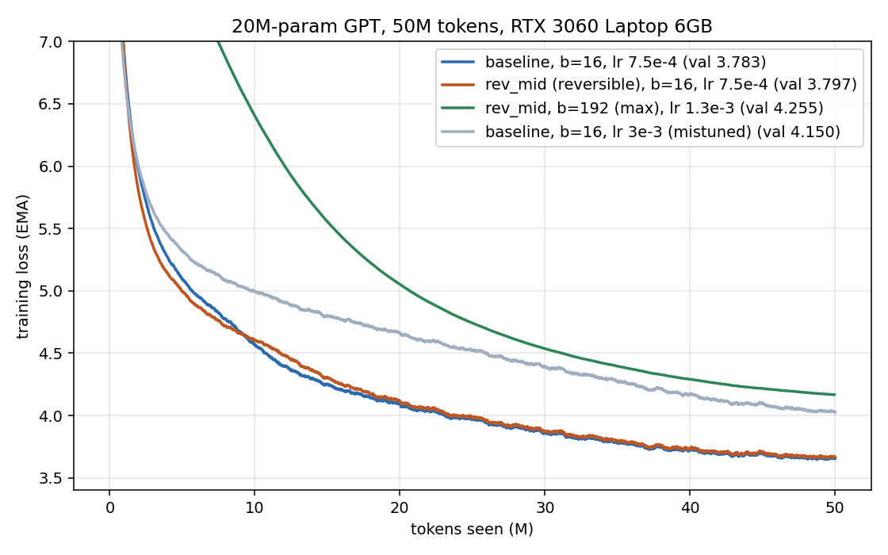
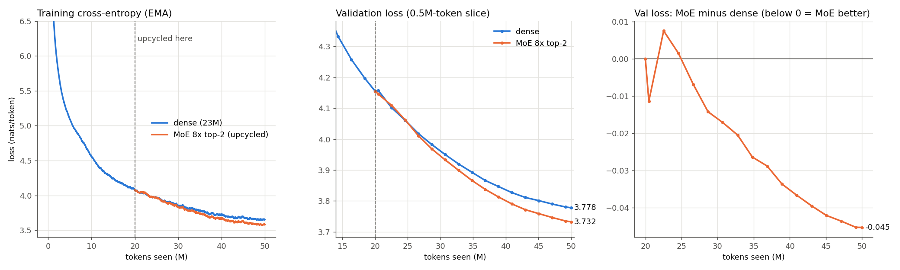
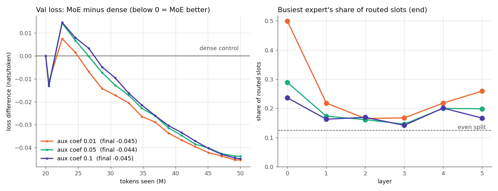

# Reversible 20M-parameter LLM — 50M tokens on a 6 GB laptop GPU

> **Also in this repo: dense → MoE sparse upcycling.** The 23M dense model below is trained for
> 20M tokens, converted into an 8-expert top-2 Mixture-of-Experts with no change in loss, and
> trained for 30M more tokens, where it beats a dense control. Summary and training logs:
> [below](#dense--moe-upcycling). Full write-up: [`UPCYCLE.md`](UPCYCLE.md).


Does making a transformer **reversible** — recomputing activations in the backward pass instead of
storing them — buy enough memory to be worth it, and what does it cost in loss and in wall-clock?

This repo answers that with three parameter-matched, token-matched runs on one
**NVIDIA RTX 3060 Laptop, 6 GB**, each at its own tuned learning rate:

| # | run | arch | batch | steps | LR | **val loss** | ppl | tok/s | **peak alloc** | peak reserved | wall |
|---|---|---|---|---|---|---|---|---|---|---|---|
| 1 | baseline, fixed batch | standard pre-norm | 16 | 6103 | 7.5e-4 | **3.783** | 43.9 | 40.5k | **2130 MB** | 2348 MB | 20.6 min |
| 2 | + reversibility, same batch | `rev_mid` (leapfrog) | 16 | 6103 | 7.5e-4 | **3.797** | 44.6 | 28.8k | **1157 MB** | 1482 MB | 28.9 min |
| 3 | + reversibility, max batch | `rev_mid` | **192** | 508 | 1.3e-3 | **4.254** | 70.4 | 35.2k | **4502 MB** | 5118 MB | 23.6 min |

All three consumed ~50M tokens (49.9–50.0M) of FineWeb-Edu at 23.08M parameters.

### Headline results

- **Accuracy: reversibility is a wash.** 3.797 vs 3.783 val loss — a **0.014-nat** gap (1.4%
  perplexity) at matched parameters, matched token budget, each at its own tuned LR.
- **Memory: 1.84x less peak allocated** (1157 vs 2130 MB); counting only activations — subtracting the
  352 MB of params + grads + Adam moments that no architecture can avoid — it is **2.2x less**.
- **Speed: ~1.5x slower**, measured twice in opposite thermal regimes (1.53x heat-soaked, 1.52x in
  boost) so the number is not a thermal artifact.
- **Max batch: 56 → 192 (3.4x)** on the same 6 GB card.
- **But max batch is the wrong way to spend a fixed token budget**: 508 optimizer steps instead of
  6103 costs 0.46 nats, and the LR was swept to prove that is not mistuning.
- **Tuning mattered ~26x more than the architecture.** Re-tuning the baseline's LR alone moved val
  loss 0.37 nats — 26x the entire baseline-vs-reversible gap.

---

## Notebooks

| notebook | what it is | outputs committed? |
|---|---|---|
| [`notebooks/01_colab_train_50M.ipynb`](notebooks/01_colab_train_50M.ipynb) | **Self-contained training notebook.** Writes `model.py` / `train.py` / `data_prep.py` into the runtime, pulls the FineWeb-Edu shard from the Hub, probes the largest batch that fits *that* GPU, then runs all three configs. Adds an fp16 + `GradScaler` path so it also works on a T4, where bf16 is unsupported. | no — it is meant to be run |
| [`notebooks/02_results_and_analysis.ipynb`](notebooks/02_results_and_analysis.ipynb) | **The full report, re-derived from the raw artifacts.** Every table, figure and ratio is computed from `runs/*/metrics.json`, `runs/*/curve.npy` and `runs/clocks_*.log` — nothing hard-coded. Needs only numpy/pandas/matplotlib, **no GPU**. | **yes** — executed, 4 figures |
| [`notebooks/03_gradient_correctness.ipynb`](notebooks/03_gradient_correctness.ipynb) | **Is the reversible backward actually correct?** Runs the fp32/CPU gradient check live, shows the autocast fix in `model.py`, the superseded runs from when it was broken, and the GPU/bf16 reconstruction measurements with trained weights. | **yes** — executed on the 3060 |

Colab: <https://colab.research.google.com/drive/1fpLLKz5KpJwemOxmJm6s811W-V_MWPgD> — notebook 01 is
generated by [`make_colab_notebook.py`](make_colab_notebook.py) from the same source files the local
runs used, so the Colab copy and the committed `.py` files cannot drift.

> **Provenance note.** Every reversibility result in this README and in `RESULTS.md` comes from the
> local 3060. Those 46 `metrics.json` files record `"gpu": "NVIDIA GeForce RTX 3060 Laptop GPU"`.
> The only runs from another GPU are the upcycling reproductions in `runs/colab_t4/`, which record
> `"gpu": "Tesla T4"`.

**Full write-up with the reasoning behind every choice: [`REPORT.md`](REPORT.md).**
Auto-generated tables for all 46 runs: [`RESULTS.md`](RESULTS.md).



---

## Dense → MoE upcycling

The dense `baseline` model is trained on a single 50M-token LR schedule. At 20M tokens its
checkpoint is **upcycled**:

- every MLP is copied into **8 identical experts**;
- a small random router is added, with **top-2 gates renormalised to sum to 1**, so the MoE
  computes exactly what the dense model computes;
- the dense MLP's AdamW moments are copied into each expert.

Training then continues for the remaining 30M tokens. A **dense control** runs from the same
checkpoint with the same batches and learning rates. The MoE has 111M parameters in total and
36M active per token. Code: [`moe.py`](moe.py) and [`upcycle.py`](upcycle.py).

| run | GPU | val loss at conversion | final val loss (2M tokens) | ppl |
|---|---|---|---|---|
| dense control | RTX 3060 | 4.15564 | 3.7800 | 43.8 |
| MoE 8x top-2, balancing coef 0.01 | RTX 3060 | 4.15563 | **3.7345** | 41.9 |
| MoE 8x top-2, balancing coef 0.05 | RTX 3060 | 4.15563 | 3.7366 | 42.0 |
| MoE 8x top-2, balancing coef 0.1 | RTX 3060 | 4.15563 | 3.7355 | 41.9 |
| dense control | Colab T4 (fp16) | 4.15651 | 3.7798 | 43.8 |
| MoE 8x top-2, balancing coef 0.01 | Colab T4 (fp16) | 4.15652 | 3.7354 | 41.9 |

- **The conversion is lossless.** Val loss changes by about 1e-5 at the switch, and there is no
  loss spike.
- **The MoE keeps training and reducing loss.** It ends **0.045 nats below the dense control**,
  and the Colab T4 rerun reproduces this to within 0.001.
- **A stronger balancing loss (0.1) fixes the routing without costing quality.** At 0.01,
  layer 0's busiest expert gets 50% of routed tokens. At 0.1 it gets 24%, and no expert in any
  layer drops below 4.9%.
- **Caveat:** top-2 routing doubles MLP compute per token, so this comparison is token-matched,
  not compute-matched. Each configuration was trained once.




### Training logs

Every run has a full console log (`stdout.log`, which includes periodic evals and per-layer
expert load), a per-step log (`train_log.csv`: step, tokens, train CE, balancing loss, lr), an
eval log (`val_log.csv`, every 250 steps) and a final `metrics.json`.

| run | stdout | per-step | eval | metrics |
|---|---|---|---|---|
| dense, 0 → 20M tokens | [log](runs/up_dense20M/stdout.log) | [csv](runs/up_dense20M/train_log.csv) | [csv](runs/up_dense20M/val_log.csv) | [json](runs/up_dense20M/metrics.json) |
| dense control, 20 → 50M | [log](runs/up_dense_cont/stdout.log) | [csv](runs/up_dense_cont/train_log.csv) | [csv](runs/up_dense_cont/val_log.csv) | [json](runs/up_dense_cont/metrics.json) |
| MoE, coef 0.01 | [log](runs/up_moe8x2/stdout.log) | [csv](runs/up_moe8x2/train_log.csv) | [csv](runs/up_moe8x2/val_log.csv) | [json](runs/up_moe8x2/metrics.json) |
| MoE, coef 0.05 | [log](runs/up_moe8x2_aux0.05/stdout.log) | [csv](runs/up_moe8x2_aux0.05/train_log.csv) | [csv](runs/up_moe8x2_aux0.05/val_log.csv) | [json](runs/up_moe8x2_aux0.05/metrics.json) |
| MoE, coef 0.1 | [log](runs/up_moe8x2_aux0.1/stdout.log) | [csv](runs/up_moe8x2_aux0.1/train_log.csv) | [csv](runs/up_moe8x2_aux0.1/val_log.csv) | [json](runs/up_moe8x2_aux0.1/metrics.json) |
| T4: dense, 0 → 20M | [log](runs/colab_t4/up_dense20M/stdout.log) | [csv](runs/colab_t4/up_dense20M/train_log.csv) | [csv](runs/colab_t4/up_dense20M/val_log.csv) | [json](runs/colab_t4/up_dense20M/metrics.json) |
| T4: dense control | [log](runs/colab_t4/up_dense_cont/stdout.log) | [csv](runs/colab_t4/up_dense_cont/train_log.csv) | [csv](runs/colab_t4/up_dense_cont/val_log.csv) | [json](runs/colab_t4/up_dense_cont/metrics.json) |
| T4: MoE, coef 0.01 | [log](runs/colab_t4/up_moe8x2/stdout.log) | [csv](runs/colab_t4/up_moe8x2/train_log.csv) | [csv](runs/colab_t4/up_moe8x2/val_log.csv) | [json](runs/colab_t4/up_moe8x2/metrics.json) |

The chained console output of each local session is also committed:
[`runs/upcycle_runs.log`](runs/upcycle_runs.log) for the main runs and
[`runs/upcycle_aux_sweep.log`](runs/upcycle_aux_sweep.log) for the balancing sweep. The sweep log
includes the out-of-memory first attempt, which was fixed by loading the checkpoint on the CPU.

### Reproduce

```bash
sh upcycle_runs.sh          # dense 20M -> MoE (coef 0.01) and dense control, 30M tokens each
sh upcycle_aux_sweep.sh     # MoE with balancing coef 0.05 and 0.1 from the same checkpoint
python plot_upcycle.py && python plot_aux_sweep.py && python export_logs.py
```

On Colab, [`notebooks/04_colab_dense_to_moe_upcycling.ipynb`](notebooks/04_colab_dense_to_moe_upcycling.ipynb)
runs the whole pipeline, using bf16 on A100/L4 and fp16 with a GradScaler on T4. It is generated by
[`make_colab_upcycle_notebook.py`](make_colab_upcycle_notebook.py).

---

## What is actually implemented

One model file, three memory strategies, **identical parameter counts** — d_model 512, 6 blocks,
8 heads, MLP 4x, RoPE, tied embeddings, vocab 8192, seq 512 → 23.08M params (18.88M non-embedding
+ 4.19M embedding).

### `baseline`
Standard pre-norm transformer. Autograd stores every activation.

### `rev_euler` — two-stream coupling (RevNet / Reformer)
```
a ← a + f(b)          f = attention block
b ← b + g(a)          g = MLP block
```
Exactly invertible from the final `(a, b)` pair, so nothing in between is stored. Structurally it is
a **semi-implicit Euler** step of a 2D ODE. Note what the coupling costs: attention only ever reads
stream `b`, and the MLP only reads `a`.

### `rev_mid` — single-stream explicit midpoint / leapfrog ← **the one that won**
```
x_{i+1} = x_{i-1} + f_i(x_i),    x_{-1} = 0
```
Inverse: `x_{i-1} = x_{i+1} − f_i(x_i)` from any adjacent pair. Symmetric and 2nd-order, and — the
practical point — it reuses **the baseline's own full-width block verbatim**. Only the skip
connection moves, so there is no channel halving and no restriction on what attention can see.

### `rev_mid_seed` / `rev_euler_seed`
Same, but the backward takes `x_0` from the saved input instead of reconstructing it (§*Reconstruction*
below). One extra stored activation; removes the block-0 gradient corruption.

Also in [`model.py`](model.py): a **fused chunked cross-entropy** (`FusedCE`) that keeps logits memory
`O(chunk)` in both directions — without it the 8192-vocab logits dominate the memory an activation
saving is supposed to free.

### Why midpoint beat Euler

10M-token selection grid, batch 16, val loss. Every architecture is bracketed on **both** sides of
its optimum, so this is best-vs-best rather than best-vs-mistuned:

| LR | baseline | `rev_mid` | `rev_euler` |
|---|---|---|---|
| 2e-4 | 5.169 | — | 5.147 |
| 4e-4 | 4.912 | 4.853 | 4.921 |
| **7.5e-4** | 4.754 | **4.672** | 4.980 |
| 1.5e-3 | 4.952 | 4.846 | 5.081 |
| 3e-3 | 5.181 | — | 5.269 |
| 6e-3 | — | — | 5.894 |

**4.672 vs 4.921** — and `rev_mid` is the only variant that also beats the baseline at this horizon.
The likely reason is structural, not numerical: leapfrog keeps the baseline's block intact, while the
two-stream coupling forces attention to read a stream that accumulates only MLP outputs.

---

## Reproducing

### Requirements
Python 3.11+, a CUDA GPU, and a CUDA build of PyTorch (2.5+; developed on 2.10.0+cu126 — install it
from <https://pytorch.org> for your CUDA version, then `pip install -r requirements.txt`).
~2.5 GB of disk for the corpus. Only the trained tokenizer (`data/bpe_8192.json`) is committed, so
tokenization is reproducible bit-for-bit; the 2.1 GB parquet shard and the `.bin` memmaps are
gitignored and regenerated.

### Data
`data_prep.py` expects one FineWeb-Edu parquet shard at `data/fineweb-edu-00000.parquet`
(the Colab notebook downloads it for you):

```bash
python data_prep.py       # byte-level BPE to 8192 tokens, then train.bin (52M) / val.bin (5M) as uint16
```

### The experiment
```bash
python gradcheck.py                              # fp32/CPU exactness of both reversible stacks + FusedCE
python revcheck.py --arch rev_mid --steps 300    # GPU/bf16 drift with TRAINED weights

python train.py --arch baseline --batch 16  --lr 7.5e-4 --tokens 50e6 --out runs/r1b   # run 1
python train.py --arch rev_mid  --batch 16  --lr 7.5e-4 --tokens 50e6 --out runs/r2    # run 2
python train.py --arch rev_mid  --batch 192 --lr 1.3e-3 --tokens 50e6 --out runs/r3    # run 3

python speed_ab.py --batch 16                    # interleaved A/B throughput
python thermal_bench.py                          # steady-state throughput + clock telemetry
python repeat_guarded.py                         # boost-regime cross-check (train.py --thermal-guard)
python report.py && python plot_curves.py        # regenerate RESULTS.md and curves_main.png
```

Find the largest batch for *your* card before run 3 — 192 is specific to 6 GB:

```bash
python train.py --arch rev_mid --probe-batch 192   # 3 steps, prints peak allocated/reserved, exits
```

### Repo layout

| path | what |
|---|---|
| [`model.py`](model.py) | all four archs, both reversible `autograd.Function`s, `FusedCE`, the autocast plumbing |
| [`train.py`](train.py) | trainer: cosine schedule to 10% of peak, fused AdamW, grad-clip 1.0, bf16 autocast, `--probe-batch`, `--thermal-guard` |
| [`data_prep.py`](data_prep.py) | parquet → BPE tokenizer → `train.bin` / `val.bin` |
| [`gradcheck.py`](gradcheck.py) | fp32/CPU gradient equivalence vs a store-everything reference |
| [`revcheck.py`](revcheck.py) | GPU/bf16 reconstruction + gradient error, at init and with trained weights |
| [`probe_mem.py`](probe_mem.py), [`bench_batch.py`](bench_batch.py) | memory probe; throughput-vs-batch sweep that detects driver spill |
| [`speed_ab.py`](speed_ab.py), [`thermal_bench.py`](thermal_bench.py), [`repeat_guarded.py`](repeat_guarded.py) | the three throughput measurements (naive interleaved, heat-soaked, boost-guarded) |
| [`report.py`](report.py), [`plot_curves.py`](plot_curves.py) | regenerate `RESULTS.md` and `curves_main.png` |
| [`driver.py`](driver.py), [`final_runs.sh`](final_runs.sh), `finals*.sh`, `sweep*.sh` | the actual chains that produced the runs, kept as a record |
| [`make_colab_notebook.py`](make_colab_notebook.py) | builds notebook 01 from `model.py` / `train.py` / `data_prep.py` |
| `runs/` | **all 46 runs**: `metrics.json`, `curve.npy`, stdout logs, clock telemetry, `revcheck_*.json` — including the superseded `buggy_*` runs |
| [`moe.py`](moe.py), [`upcycle.py`](upcycle.py) | MoE layer and dense→MoE conversion; dense / resume trainer for the upcycling study |
| [`upcycle_runs.sh`](upcycle_runs.sh), [`upcycle_aux_sweep.sh`](upcycle_aux_sweep.sh) | the chains that produced the upcycling runs |
| [`plot_upcycle.py`](plot_upcycle.py), [`plot_aux_sweep.py`](plot_aux_sweep.py), [`export_logs.py`](export_logs.py) | upcycling figures; `train_log.csv` / `val_log.csv` export |
| [`make_colab_upcycle_notebook.py`](make_colab_upcycle_notebook.py) | builds notebook 04 from `model.py` / `train.py` / `moe.py` / `upcycle.py` |
| `runs/up_*`, `runs/colab_t4/` | upcycling runs: `stdout.log`, `train_log.csv`, `val_log.csv`, `metrics.json`, `curve.npy`, `evals.npy` |
| `notebooks/` | the three notebooks above, plus notebook 04 (dense → MoE upcycling on Colab) |

---

## Findings worth reading before you trust reversibility

### A silent, catastrophic bug: the autocast weight cache kills reversible gradients

**This invalidated an entire first round of results.** Under `torch.autocast` the bf16 copy of each
weight is **cached**. A reversible backward recomputes blocks inside `torch.autograd.grad`, but the
forward ran under `torch.no_grad()` — so the cached bf16 copy carries **no `grad_fn`**, the recompute
cannot reach the fp32 parameter, and `allow_unused=True` returns `None` for **every `Linear` weight in
every block**.

Result: all attention and MLP matrices were **frozen at initialization**. Only LayerNorm gains and the
embedding trained. The loss still fell from 7.5 to 4.9, so nothing looked wrong — and `gradcheck.py`
passed at 6e-7 the whole time, because it runs fp32 on CPU where there is no weight cache.

> **Correctness tests must run in the precision and on the device you actually train in.**

The fix is one context manager, re-entering autocast with the cache disabled inside the backward:

```python
with torch.autocast("cuda", dtype=dtype, cache_enabled=False), torch.enable_grad():
    ...
```

Best reversible result at 10M tokens, before and after the fix (best over both variants and the whole
LR grid):

| | best val @10M | best LR | LR response |
|---|---|---|---|
| broken | 5.267 (`rev_euler`) | 6e-3 | nearly flat — 0.02 nats over a 4x LR range |
| fixed | **4.672** (`rev_mid`) | 7.5e-4 | sharp interior minimum — 0.18 nats over the same range |

**A flat LR response was the tell** — a model that barely cares about its learning rate over a 4x
range is usually not training. `model.py` now *raises* rather than silently accepting a `None`
gradient for a block parameter. The bug also flipped the variant verdict: while broken, `rev_euler`
appeared to beat `rev_mid`.

### Reconstruction of the *first* activation is catastrophically ill-conditioned

Measured on GPU, in bf16, with trained weights (`runs/revcheck_mid_trained.json`): `x_1`…`x_4` come
back to ~1e-4–1e-3 relative error, and then `x_0` fails outright — 87 relative, with the minimum
gradient cosine similarity dropping to 0.15 (0.9997 at init, where everything is still small).
`REPORT.md` §5b localises it: block 0 at cosine 0.054, blocks 1–5 at 0.998–1.000.

The cause is **catastrophic cancellation, not rounding**: `x_0` is embedding-scale, but it is
recovered by subtracting six blocks' worth of accumulated residual. Re-running the check in fp32 only
improves block 0 to ~0.24 — precision does not fix an ill-conditioned subtraction.

It is cheap to fix, because `x_0` is already an *input* to the reversible `Function` and can simply be
stored (`rev_mid_seed`):

| | block-0 cosine | max grad rel err | val @10M | peak alloc (b=16) | max batch |
|---|---|---|---|---|---|
| `rev_mid` | 0.054 | 1.20 | **4.6716** | 1157 MB | 192 |
| `rev_mid_seed` | **0.9999** | **0.031** | 4.6731 | 1176 MB | 176 |

**And the surprise is that fixing it changes nothing.** Restoring block 0's gradient from near-random
to exact moves val loss by 0.0015 nats — noise — while costing ~179 MB at batch 192, enough to drop
the max batch below 192. At 6 layers the first block does little enough work that a garbage gradient
there is harmless. I would expect that to stop being true with depth.

### The maximum batch is not how you spend a fixed token budget

Reversibility raises the largest batch that fits from 56 to 192, but at 50M tokens that means **508
optimizer steps instead of 6103**, and the loss regresses 0.46 nats. The LR was properly bracketed:

| batch 192, LR | 6.5e-4 | **1.3e-3** | 2.6e-3 | 5.2e-3 |
|---|---|---|---|---|
| val loss | 4.469 | **4.254** | 4.402 | 4.989 |

The optimum is only ~1.7x the batch-16 LR for a 12x larger batch — square-root scaling (2.6e-3)
overshoots, because at 508 steps the run is nowhere near convergence and a large LR mostly costs early
stability. Big batches are worth having when **memory** is the binding constraint (longer sequences, a
bigger model, avoiding gradient accumulation), not as a way to spend tokens faster.

### Throughput on a laptop GPU needs a thermal method, or it means nothing

Under sustained load this chassis reaches 88–89 °C and the driver's **SW thermal slowdown** governor
drops the SM clock from ~1880 MHz to ~800–1000 MHz, roughly halving throughput mid-run. Identical
configs measured anywhere from 28.3k to 40.5k tok/s depending on how warm the card was at launch —
so the `tok/s` column in the headline table is *not* an architecture comparison.

Two independent methods, from opposite ends of the thermal envelope:

| method | regime | baseline / `rev_mid` |
|---|---|---|
| interleaved heat-soak ([`thermal_bench.py`](thermal_bench.py)) | throttled, pinned 1387 MHz | 1.53x |
| boost-regime guard ([`repeat_guarded.py`](repeat_guarded.py)) | unthrottled, ≥1702 MHz | **1.52x** |

They agree to within 1%, so the ~1.5x cost is a property of the code, not of when a run started. It is
more than the ~1.33x "one extra forward" theory predicts, because the backward re-runs each block
under `torch.autograd.grad` with a fresh autocast cast per block, which does not fuse as well as a
plain backward.

The guard also settles whether the 50M-token experiment could be run unthrottled here: **it cannot.**
The boost regime lasts 23–27 s — under 4% of one run. Sustaining it means dissipating 114 W against
the ~59 W this chassis holds at its 89 °C ceiling, a ~2x cooling deficit that a cooling pad's typical
3–8 °C does not bridge. The throttled numbers are the real sustained performance of this hardware.
(`--thermal-guard` is a *measurement-regime* guard, not a hardware safety device; the card's own
protection sits near 93 °C and was never approached. Its loss values at 1–2M tokens are meaningless.)

### Two Windows-specific memory traps

- **There is no OOM at the ceiling.** Past ~5120 MB reserved the driver falls back to shared system
  memory instead of raising. Batch 256 "succeeded" at 6382 MB reserved with throughput down ~20% —
  check `max_memory_reserved` against `torch.cuda.mem_get_info()` rather than trusting the absence of
  an exception.
- **`expandable_segments:True` is a no-op on Windows.** It is the usual remedy for the ~1.2x gap
  between allocated and reserved; here it changed reserved by exactly 0 MB at every batch. That
  fragmentation gap is what actually caps the batch at 192 — allocated is only 4502 MB.

---

## Caveats

- **One seed (1234) per configuration.** The 0.014-nat baseline-vs-reversible gap is smaller than
  seed noise almost certainly is at this scale; read it as "no measurable difference", not as a
  ranking.
- **6 layers, 23M params, 50M tokens.** Two of the findings are explicitly depth-dependent — the
  harmless block-0 gradient, and the ~1.5x recompute overhead, which is amortized differently in
  deeper stacks.
- **The boost-regime runs are short** (12–239 steps), so their tok/s carries some warm-up
  amortization; the batch-192 entry timed only 7 steps and is the noisiest number in the repo.
- **`speed_ab_b16.txt` is tail-truncated** (the `.json` next to it captured a crash from a missing
  `nvidia-ml-py`); notebook 02 parses what survived, which is the per-round data that matters.
- Deterministic clocks need an **admin** shell: `nvidia-smi -lgc 1000,1000` to pin, `nvidia-smi -rgc`
  to restore. Everything here was measured without that, which is why the thermal methodology exists.
